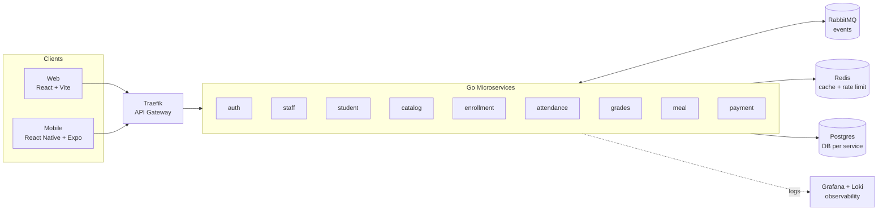

# MyDreamCampus

A full-stack university management platform built with microservices architecture. Handles student enrollment, course scheduling, attendance tracking, grading, and cafeteria operations across web and mobile.

## Screenshots

> _Placeholders — drop your captures into `docs/screenshots/` and update the paths._

| Web | Mobile |
|-----|--------|
|  |  |

## Architecture



**9 independent microservices** communicate asynchronously via RabbitMQ using the transactional outbox pattern. Each service owns its database, ensuring data isolation and independent deployability.

| Service | Port | Responsibility |
|---------|------|---------------|
| auth | 8001 | JWT authentication, session management, rate limiting |
| staff | 8002 | Personnel management, teacher profiles |
| student | 8003 | Student records, bulk CSV import, advisor assignment |
| catalog | 8004 | Course catalog, semester planning, schedule management |
| enrollment | 8005 | Course registration, prerequisite validation, quota control |
| attendance | 8006 | QR-based session tracking, attendance finalization |
| grades | 8007 | Score entry, GPA calculation, transcript generation |
| meal | 8008 | Cafeteria menus, meal reservations, QR validation |
| payment | 50051 (gRPC) | Payment processing (internal service) |

## Tech Stack

**Backend**
- Go 1.26, Gin, pgx/v5, sqlc, goose
- PostgreSQL 18, RabbitMQ 4.0, Redis 7.2
- JWT + Argon2, Zap structured logging

**Frontend**
- React 19, Vite, Tailwind CSS v4, shadcn/ui
- TanStack React Query, React Hook Form + Zod
- React Router v7, ky HTTP client

**Mobile**
- React Native 0.81, Expo 54, Expo Router
- TanStack React Query, Axios, expo-secure-store

**Infrastructure**
- Docker Compose, Traefik v3.2
- Grafana + Loki + Promtail (observability)

## Key Technical Decisions

- **Event-Driven**: Services publish domain events (e.g. `student.created`, `course.semester.updated`) via RabbitMQ with guaranteed delivery through the outbox pattern
- **Database per Service**: Each microservice has its own PostgreSQL instance for data isolation
- **Type-Safe SQL**: sqlc generates compile-time-safe Go code from raw SQL queries
- **Multi-Tier Rate Limiting**: IP-based, user-based, and endpoint-specific limits via Redis
- **RBAC**: Role-based access control (admin, teacher, student) enforced at the API gateway level
- **Idempotent Consumers**: Deduplication on the consumer side prevents duplicate event processing
- **Dead Letter Queues**: Failed messages are captured for debugging without blocking the pipeline

## Project Structure

```
mydreamcampus/
├── backend/
│   ├── services/           # 9 microservices (each with cmd/, internal/, sql/)
│   ├── shared/             # Common packages: middleware, rabbitmq, redis, utils, logger
│   ├── infrastructure/     # Docker Compose, Traefik, Grafana, Loki configs
│   ├── docs/               # Service API documentation
│   └── go.work             # Go workspace
├── frontend/               # React + Vite web application
├── mobile/                 # React Native (Expo) mobile app
└── old-frontend/           # Legacy Next.js frontend (deprecated)
```

## Running Locally

**Prerequisites:** Docker (with the compose plugin), Go 1.26+, Node 20+, Bun, and `air` on `$PATH` for backend hot-reload (`go install github.com/air-verse/air@latest`).

```bash
# Everything you need in one shot (infra + 9 backend services, hot-reload)
make up

# Frontend (new terminal)
make frontend

# Mobile (new terminal)
make mobile

# When you're done
make down
```

Run `make help` to see the full list of targets (`infra`, `backend`, `status`, `logs`, `clean`).

### Endpoints

- Web (Vite dev server): http://localhost:5173
- API (via Traefik): http://localhost/api/v1/*
- RabbitMQ management: http://localhost:15672 (`guest` / `guest`)

Each service ships its own `.env.example` under `backend/services/<name>/`. Copy them to `.env` before the first run if you want to override defaults.

## License

MIT
